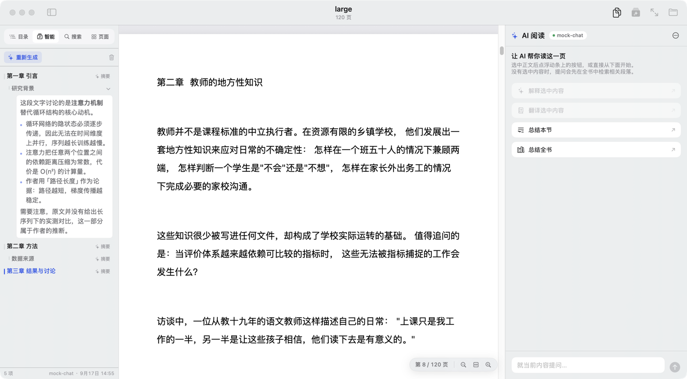
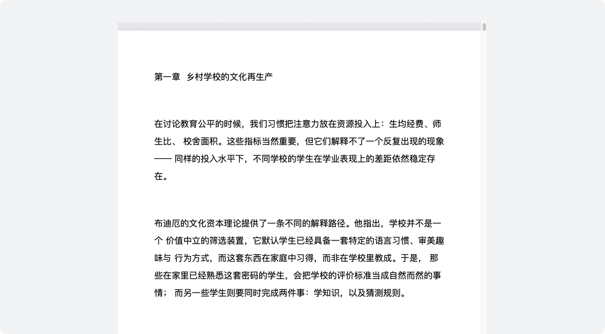

# LumenReader（流明）

macOS 原生阅读器：**PDF + EPUB + 自接 AI**。纯 Swift / SwiftUI，无 Xcode 依赖，
无 Electron，无云端。

定位不是「又一个阅读器」，而是**给做研究的人用的阅读工具**：把「读懂一篇文献」这件事
拆成可被机器帮上的几步——结构化目录、逐节摘要、划词解释、整本总结、跨会话记忆——
并且这些 AI 能力全部走**用户自己的** OpenAI 兼容端点（BYOK），不经过任何中间服务。

```
┌────┬──────────┬───────────────────────────┬──────────────┐
│ 图 │   侧栏   │        阅读区             │   AI 面板    │
│ 标 │ 目录/智能 │   PDF（PDFKit）/ EPUB     │  对话/摘要   │
│ 栏 │ 搜索/批注│   （WKWebView）           │  Agent 切换  │
│ 常 │ 页面     │                           │              │
│ 驻 │ 固定 248 │                           │ ← 可拖拽 →   │
└────┴──────────┴───────────────────────────┴──────────────┘
```

左侧那条 52pt 的**图标栏常驻**：内容面板可以整体收起（点当前高亮的那一格），
但切页签的入口不会跟着消失——面板收起时它还在，点一下就展开。
再往右的**侧栏内容面板宽度固定为 248pt**（无可拖拽入口）：想给正文腾地方就
收起整块侧栏，而不是把目录挤到看不清。**只有右侧 AI 面板可拖拽调宽**
（双击分隔线复位，最小 300pt）。

**AI 智能目录** —— 让 AI 读一遍每页开头，推断出章节结构；摘要在点开某一节时才生成。



**沉浸模式**（`⌃⌘F`）—— 收起两侧面板与工具栏，正文限宽居中，底部一条自动隐现的控制条。



### 批注与高亮

划词浮动条上有「高亮」「批注」两个按钮，AI 每条回复旁也有「复制」「添加到批注」。
PDF 的批注是**原生 PDFKit annotation 并写回原文件**——用系统「预览」或 Acrobat
打开同一个文件都能看见、能继续编辑。侧栏「批注」页签汇总全书批注，可逐条跳转、删除。

EPUB 的批注存在应用数据目录（EPUB 是压缩包，写回会破坏结构与签名），界面里写明了这一点。

### Agent

提示词旁边可以选 Agent：**角色设定 + 技能集 + 自定义指令 + 温度覆盖 + 是否联网检索**。
内置四个预设（苏格拉底导师 / 教育学研究者 / 批判审稿人 / 文献综述助手），也可以自己建。

换了模型 / 模板 / Agent 之后想对同一段内容再看一次，用那条回答底部的
「重新生成」——不必重新划词。它是付费动作，所以只放在菜单与气泡上，没有快捷键。

勾了「联网检索」的 Agent（或打开输入框左边的联网开关）会先查
**Crossref · OpenAlex · arXiv** 三个公开学术库，
把命中的文献连同 DOI / 编号一起交给模型，并要求它只能引用检索到的、注明出处。
知网、万方、Web of Science 接不了（无公开接口 / 需机构订阅），界面上如实说明原因。

---

## 30 秒上手

```bash
./build.sh              # 编译 + 组装 dist/Lumen.app + 签名
./build.sh release      # Release 构建
./build.sh debug run    # 编译并启动
```

签名优先用自签证书「Lumen Dev」，没有证书时退回 ad-hoc。这一条有实际影响：
ad-hoc 的身份就是 CDHash，每次重编译都会变，login 钥匙串的 ACL 会把新构建当成
「陌生程序」而在用到 API Key 时弹一次授权框。自签证书的身份是稳定的，弹窗因此从
「每次重编译」降到「切换签名身份那一次」。证书建法见 `docs/ISSUES-2026-09-17.md` 第 9 节。

首次跑之前需要知道的一件事：**`swift build` 必须带 `--disable-sandbox`**。
CommandLineTools 自带的 SwiftPM 在沙箱里编译 `Package.swift` 会报 `sandbox_apply` 失败，
而这个项目不含任何网络依赖，关掉沙箱没有任何风险。`build.sh` 已经带上了。

打开一本书：

```bash
dist/Lumen.app/Contents/MacOS/Lumen --open /path/to/book.pdf
```

配置 AI：应用内「设置 → AI」，从预设里选一家（DeepSeek / OpenAI / Kimi / 智谱 / 通义…）
填入 API Key，或者指向本机的 Ollama / LM Studio。**API Key 只进 Keychain，不落盘、不进日志。**

---

## 目录导航

| 路径 | 是什么 |
| --- | --- |
| `Sources/LumenKit/` | **引擎层**。解析、存储、AI 协议、提示词。不依赖 SwiftUI，可单独测试 |
| `Sources/LumenApp/` | **界面层**。SwiftUI 视图、窗口外壳、设置页 |
| `tools/` | 自检工具：桩服务、测试素材生成、截图取色 |
| `docs/ARCHITECTURE.md` | 模块地图、数据流、关键设计决策及理由 |
| `docs/VERIFY.md` | **自检通道手册**。这台机器上「怎么证明改动是对的」全在这里 |
| `docs/ISSUES-2026-09-17.md` | 两批共 17 项问题的排查 / 根因 / 修复 / 验证记录 |
| `docs/PROGRESS.md` | 批次进度、已完成 / 待办清单 |
| `docs/design/` | 两轮设计稿（`DESIGN.md` 第一轮、`DESIGN-v2.md` 第二轮） |

### 引擎层 / 界面层的分界线在哪

一句话：**`LumenKit` 不知道 SwiftUI 存在**。

- 界面层不直接碰 PDFKit —— 通过 `PDFController` / `EPUBController` 两个包装。
- 阅读区与外框通过 `ReaderBridge` 通信（唯一的通道，双向各走一半）。
- AI 调用只依赖 `AIProvider` 协议，换服务商不波及界面。

这样分层不是为了「架构好看」，而是为了**能在没有屏幕的机器上验证**：
业务逻辑只要不在 View 里，就可以用命令行走一遍并断言结果。

---

## 硬约束（踩过的坑，务必遵守）

这几条都是实测撞出来的，违反其中任何一条都会得到一个「不崩溃、不报错、但结果莫名其妙」
的状态——那是最难查的一类问题。

1. **布尔启动开关必须带值**：写 `--ocr 1`，不要写裸的 `--ocr`。
   macOS 会把命令行参数注入 `UserDefaults` 的 argument domain，裸开关后面紧跟另一个
   `-` 开头的 token 时整条参数序列会被解错，症状是 **SwiftUI 的 WindowGroup 完全不创建
   窗口**（0 窗口、不崩溃、日志干净）。详见 `LaunchDiagnostics.swift` 里 `flag(_:)` 的注释。

2. **设置解码必须逐字段容错**：`ReaderSettings` / `AISettings` / `UISettings` / `AppSettings`
   的每个字段都写成 `(try? container.decode(X.self, forKey:)) ?? 默认值`。
   否则旧 `settings.json` 缺一个键就整份解码失败，**用户的偏好被静默重置成默认值**。

3. **不要与 SwiftUI 争 `NSWindow.appearance`**：设完会被抹回 `nil`。
   要改外观就设 `NSApp.appearance`。

4. **`cacheDisplay` 渲染 `.regularMaterial` 不可靠**：离屏绘制会把材质画成一层
   不随外观变化的近白色。要判断材质 / 主题，走录屏通道（`--capture-screen 1`）
   或读日志里的 `effectiveAppearance`。详见 `docs/VERIFY.md`。

5. **给用户看的设置项若只是部分生效，属于欺骗性设计**：要么做全，要么在界面上写清边界。

6. **`.alert` 里放不了输入框**：SwiftUI macOS 的 alert actions 会忽略 `TextField`。
   需要输入就走自建卡片（见 `PageJumpPanel.swift`）。

7. **不要把库返回的字符串直接和常量比**。PDFKit 里
   `PDFAnnotationSubtype.highlight.rawValue == "/Highlight"`（**带**斜杠），
   而 `annotation.type` 返回 `"Highlight"`（**不带**）。直接比较恒为假，
   症状是「批注明明写进磁盘了，清单里一条都没有」——两边各自都正常，只有比较那行是错的。
   现在统一走 `lumenTypeName`（去斜杠）。同类陷阱还有：`Text` 便签会自动带一个
   `Popup` 影子批注，不排除它计数会虚高一倍。

8. **断言必须能被证伪**。一条断言如果在实现明显写错时依然通过，它就是恒真的。
   踩过两次：冒烟里「布局报告存在」的 grep 模式写错，解析出 0 行、14 个用例全部"通过"；
   `--search-report` 把查询词写死成英文 `"the"`，而测试素材全是中文，0 命中却报
   「搜索有命中 ❌」——**看起来像搜索坏了，其实是测试词不在书里**。
   现在的规矩：断言指向**外部可核对的产物**（重新从磁盘打开文件数批注、独立进程读文件），
   并把解析出的条数一并打出来；写完人为让它失败一次。

---

## 验证这件事，为什么值得单开一份文档

开发这台机器的条件是：**没有屏幕可看**（助手无视觉通道），但**有录屏权限**。

所以「看起来对不对」不能靠肉眼，只能靠可断言的客观信号：

- 几何断言 —— 视图自己上报 frame，检查包含 / 重叠关系（`--layout-report 1`）
- 行为回读 —— 功能产物（剪贴板、磁盘文件、日志）真的读回来核对（`--run-action`）
- 规则实跑 —— 把规则喂进实现，断言输出（`--keys-report 1`）
- 真实像素 —— 录屏抓图 + 按比例取色，判深浅（`--capture-screen` + `tools/sample_pixels.swift`）
- 桩服务 —— AI 链路走本机桩服务，可重复、不烧钱（`tools/mock_openai_server.py`）

**完整手册在 [`docs/VERIFY.md`](docs/VERIFY.md)**，新增功能时请顺手补上对应的验证通道。
