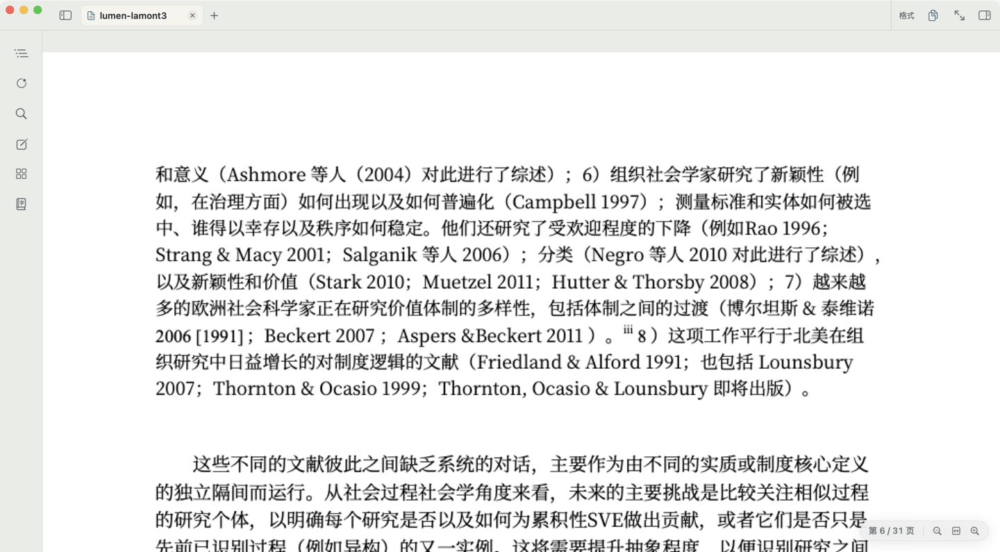
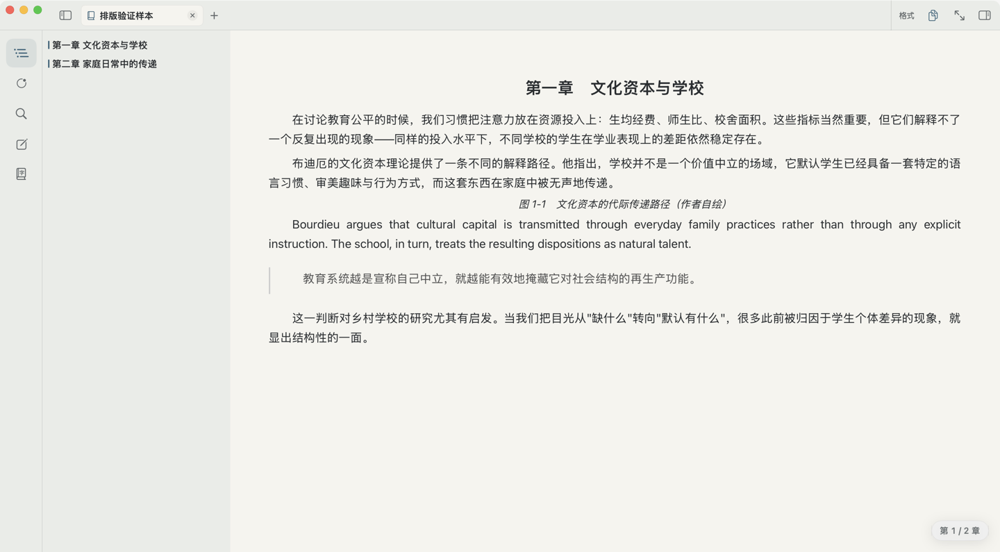
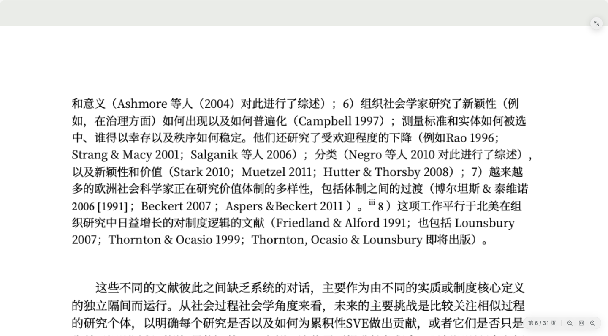
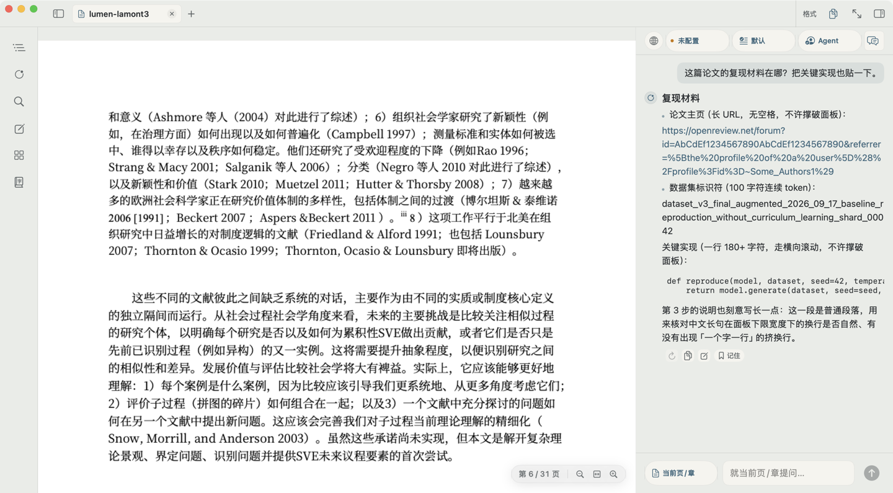
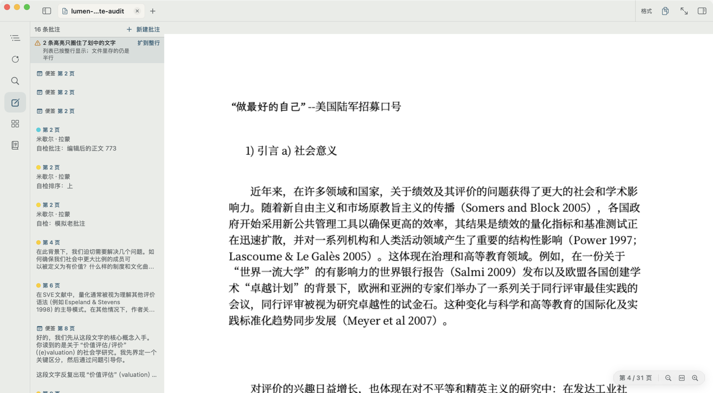
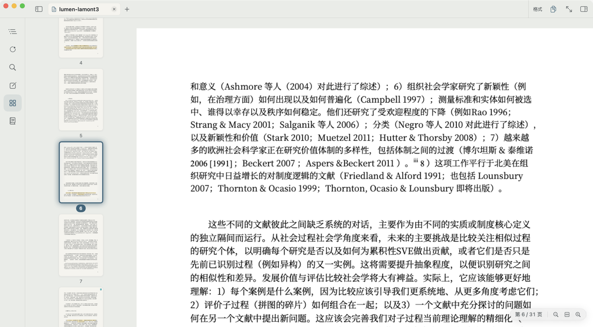
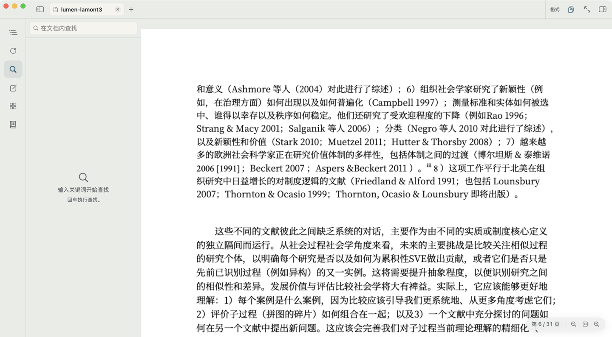
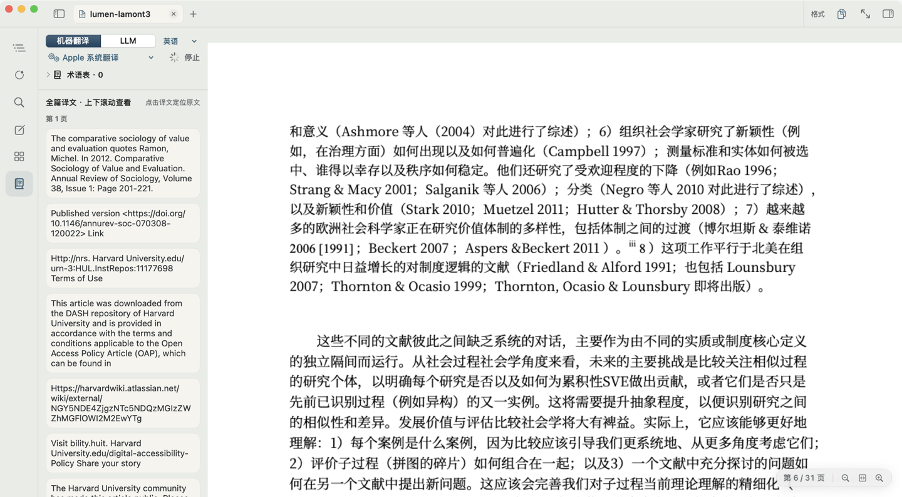
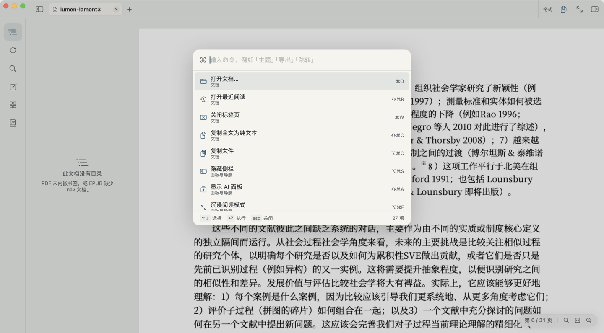

<div align="center">


# Lumen · 流明

**面向文献阅读的 macOS 原生 PDF / EPUB 阅读器**

[下载最新版本](https://github.com/JiongN/LumenReader/releases) · [源码构建](#源码构建) · [数据与隐私](#数据与隐私)

SwiftUI · PDFKit · WebKit · 零第三方依赖

**本项目由 AI 开发完成**

</div>

---

## Lumen · 流明

Lumen，拉丁语意为「光」。

在现代科学中，lumen 是光通量的单位——衡量真正抵达人眼、被人感知的光。

我们喜欢它，是因为阅读也是如此。

文字可以很多，信息可以无限，但阅读真正发生的时刻，是其中一些东西终于被看见、被理解，与已有的思想连接起来。

中文名「流明」原本是 Lumen 的音译。我们愿意赋予它另一层含义：

**流，是文字、知识与思想的流动。**
**明，是看见，也是理解。**

中国人很早就把「明」用于描述一种超越视觉的理解。《大学》言「在明明德」，《老子》言「自知者明」。

而朱熹写读书：

> 天光云影共徘徊，
> 为有源头活水来。

光与流水相遇，方有清明。

在 Lumen 里，AI 也只是这束光的一部分。

它不替你得出结论，也不试图成为阅读的中心。它做的是解释晦涩之处，连接散落的线索，引入新的背景与视角，让原本停滞的理解重新流动起来。

**好的产品，不该让 AI 代替思考。**
**它更像一束启蒙之光，让人看见更多，也留下继续追问的余地。**

Lumen，让理解继续流动。

---

## 功能

### 沉浸阅读

PDF 原生渲染与 EPUB 章节排版，浅色纸面与深夜主题，阅读时不被打扰。

- PDF：连续滚动、适宽适配、页间留白可调；EPUB：字体、字号、行距、对齐由你做主
- 沉浸模式：面板全收，正文居中限宽，只剩你和文字
- 多标签与独立窗口，多本书并行不乱







### AI 伴读（BYOK）

接入你自己的 OpenAI 兼容接口（DeepSeek、OpenAI、Kimi、智谱、通义，或本机 Ollama / LM Studio）。没有自建账号，没有中转服务器，密钥只存在本机。

- 划词即问：解释、翻译、追问，选中就能问
- 当前页 / 当前章问答，模型先读到你读到的地方
- 全文分层摘要与智能目录：抽样分段送入模型，长书也有提纲
- 全局会话：多本文档共用一份对话，引用可跳回原文核对
- Agent 与提示词模板：定义角色、技能集与是否联网
- 可选联网学术检索：Crossref、OpenAlex、arXiv，免配置密钥



### 批注与导航

高亮、便签、页面批注——**PDF 批注直接写回原文件**，其他阅读器里依然可见。

- 高亮锚回原文；锚不上时退回页面便签，绝不静默丢失
- 批注清单按页分组，点击定位，可编辑可删除
- 目录、缩略图、全文搜索、页面跳转，四个页签各司其职







### 翻译与 OCR

- PDF 逐段对照翻译：原文上方堆叠译文，上下滑动通读全文，点击译文定位原文
- EPUB 逐段翻译：译文嵌入正文流
- 引擎可选：必应免密钥直用，或 Apple 系统翻译（可下载离线语言包）
- 扫描件不慌：Vision OCR 认出当前页文字，翻译与检索照常进行



### 键盘优先

- 命令面板（⌘K）覆盖全部动作
- 快捷键全部可自定义，冲突一目了然
- 侧栏页签 ⌘1–⌘6：目录、智能目录、搜索、批注、页面、翻译



## 下载与运行

已发布版本见 [GitHub Releases](https://github.com/JiongN/LumenReader/releases)。要求 **macOS 15 或更新版本**。发布包按构建机器的架构生成；当前为 **Apple Silicon / arm64**，不是通用二进制。

解压 ZIP 后将 `Lumen.app` 放入「应用程序」。应用使用自签签名，**未做 Apple 公证**；首次打开需「右键 → 打开」并在系统「隐私与安全性」中允许一次。应用内置「检查更新」（设置 → 关于），有新版本时给出版本说明与下载链接，不会自动覆盖安装。

## 源码构建

需要 Apple Command Line Tools（Swift 6 工具链）；没有第三方 Swift 包依赖。

```bash
./build.sh                 # Debug → dist/Lumen.app
./build.sh release         # Release → dist/Lumen.app
./build.sh debug run       # 构建并启动
swift test --disable-sandbox
./publish.sh v1.1.0 --no-upload  # 仅本地打包，不创建或推送 tag
```

打包版本必须与 `Resources/Info.plist` 一致。`--disable-sandbox` 用于兼容本项目的 SwiftPM 构建环境。对外发布的前提与命令见 [发布说明](docs/RELEASING.md)。

## 项目目录

| 目录 | 职责 | 是否可清理 |
| --- | --- | --- |
| `Sources/LumenKit/` | 文档解析、存储、AI、OCR 等核心能力 | 保留源码 |
| `Sources/LumenApp/` | macOS 窗口、阅读控制器、SwiftUI、诊断入口 | 保留源码 |
| `Tests/` | 核心与会话数据回归测试 | 保留 |
| `Resources/` | Info.plist、正式应用图标 | 保留 |
| `branding/` | 图标 SVG 与生成工具 | 保留原始设计 |
| `tools/` | 测试素材、模拟 AI 服务及验证工具 | 保留 |
| `docs/` | 当前架构、操作、验证和审计文档 | 保留 |
| `docs/images/` | README 与文档用图 | 保留 |
| `docs/archive/` | 历史研究、方案、进度和验证记录 | 历史证据，不代表当前实现 |
| `docs/verification/` | 本地验证截图、日志、测试素材 | 可再生；不入 Git |
| `dist/` | 最近一次组装好的应用 | 可重新构建 |
| `releases/<版本>/` | 集中分发的 ZIP/可选 DMG、校验和、构建信息 | 正式发布成果，保留；不入 Git |
| `.build/`、`build/` | SwiftPM 缓存、图标中间产物 | 可再生 |

`./build.sh clean` 只清 `.build/` 与 `dist/`，不删除 `releases/` 或用户数据。

## 数据与隐私

数据位于 `~/Library/Application Support/com.jn.lumen/`，缓存位于 `~/Library/Caches/com.jn.lumen/`。**密钥在 `credentials/` 下以未加密文件保存**，目录权限 0700、文件权限 0600；它不是钥匙串或加密保险箱。共享配置、截图或备份时不要包含凭据目录。旧钥匙串条目不自动读取或删除。

向在线模型提问时，选区、上下文、会话历史或摘要片段会发到所选服务商；联网检索会发送查询，在线翻译会发送待译文本。PDF 批注直接修改原文件，重要原件请保留备份。损坏的 JSON 会先保留 `.corrupt-*` 文件供恢复。

## 文档入口与已知限制

- [架构与数据流](docs/ARCHITECTURE.md)
- [验证与复现](docs/VERIFY.md)
- [发布与目录维护](docs/RELEASING.md)
- [维护约束](AGENTS.md)

大型 PDF 批注保存仍可能短暂阻塞界面；后台标签没有自动卸载策略。EPUB 暂不支持 ZIP64、分卷、加密、符号链接及解包总量超过 512 MB 的包。PDF 为固定版式，EPUB 字体与行距设置不会重排 PDF。全局会话可混合多本文档，引用跳转会核对来源；切换文档不会自动创建新会话。全文摘要会抽样并分段，不能等同于将整书逐字送入模型。
