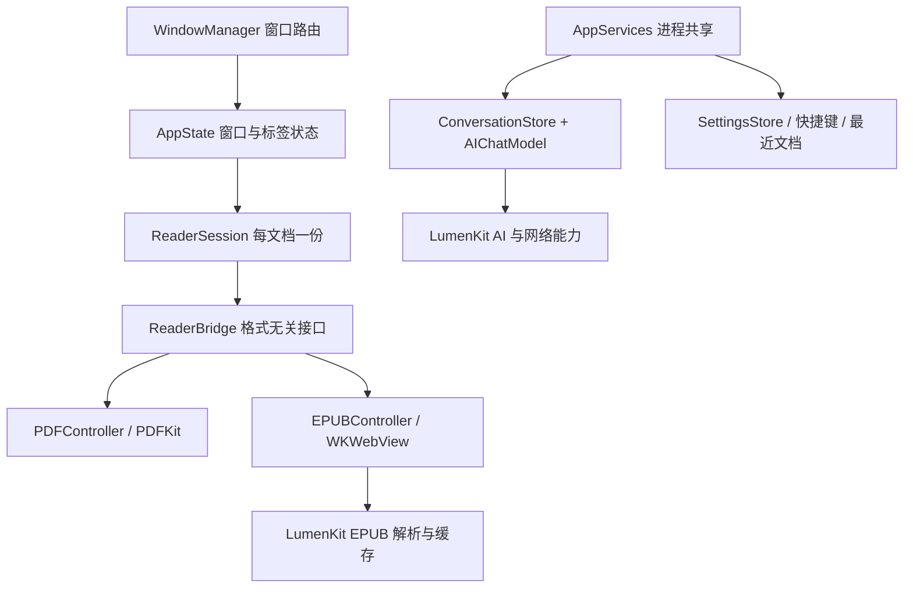

# 系统架构

本文件描述 2026-09-21 审计后的实现。历史推导与旧测量保存在 [原架构记录](archive/ARCHITECTURE-before-20260921-audit.md)，冲突时以当前源码和本文件为准。

## 分层与所有权

- `LumenKit` 不依赖 SwiftUI，包含文档类型、EPUB、存储、AI 协议、OCR 和纯算法。
- `LumenApp` 管理主线程视图与平台框架桥接；PDFKit 文档和 WKWebView 由各控制器持有。
- `AppState` 是窗口级；`ReaderSession` 是文档级，持有 bridge、智能目录和文档任务。AI 对话是进程级共享，**不属于每个标签**。
- 多标签阅读视图以叠层宿主，但完整 PDFView/WKWebView 只保活最近两个。更早的标签保留会话与落盘位置，再次激活时重建平台视图。关闭标签集中取消文档任务、保存位置和解除 bridge 闭包；迁出为独立窗口不是关闭。

## 主要数据流

1. 打开路径 → WindowManager → AppState 创建/选择标签 → 阅读视图解析 → bridge 发布位置、目录、选区和能力。
2. AI 请求 → 捕获文档与配置快照 → 可选检索 → SSE 流 → 当前消息 → 完成时持久化。停止会同步结束当前消息；取消任务恢复后禁止刷新、清空或结束后继请求。
3. PDF 批注 → PDFKit annotation → 摘除搜索临时高亮 → 原始颜色序列化 → 原子写回原 PDF → 恢复搜索高亮。
4. EPUB → ZIP 中央目录预检 → 串行解包 → 禁止外部 XML 实体 → 校验包内资源路径 → WebKit 加载。缓存按路径、文件大小和修改时间区分版本；同大小同时间替换仍可能复用旧缓存。
5. EPUB 内链按实际章节匹配，跨章时更新控制器状态再加载锚点；外链只允许显式点击的 HTTP/HTTPS/mailto，禁止远端页面替换正文。书内脚本仍开启，参见审计剩余风险。
6. EPUB 翻译→ WebKit 提取当前章可见段落→过滤空白、无字母和已是目标语言的内容→按设置调用 Apple 系统翻译、Microsoft 或 LLM→按索引将译文紧跟写在对应原文下方。段落识别同时覆盖语义标签与出版商常用的叶级 `div/section/article`；译文合并后批量写入 WebKit。章节、引擎、目标语言或术语表变化时会取消旧任务；标签转入后台时也会立即取消，不与前台 PDF 渲染争抢资源。

## 持久化

| 位置 | 内容 |
| --- | --- |
| `settings.json` | 界面、阅读、模型与 Agent 配置，不含 API 密钥 |
| `credentials/*.key` | 本机密钥，0700/0600 权限，未加密 |
| `conversations.json` | 所有窗口共享的历史与活动会话 |
| `recent.json` / `keybindings.json` / `memory.json` | 最近文档、快捷键、记忆 |
| `docs/<路径哈希>/` | 阅读位置、EPUB 批注、智能目录、翻译缓存 |
| 系统 Cache 目录下 `epub/` | 解包后的 EPUB，可再生 |

缺少兼容字段可回落默认值，正文或消息集合类型错误必须抛出并触发损坏备份，不能默默变空后覆盖。备份失败时目前只有日志；详见审计中的恢复边界。路径哈希不是内容标识，移动文件后不会自动找回原路径下的状态。

## UI 与功能入口

`ActionEntries` 统一部分菜单的职责与可用性；`LumenAction` 统一菜单、命令面板和快捷键。磁盘导出归文件菜单，剪贴板操作归复制入口，会话管理归 AI 头部会话菜单。PDF 与 EPUB 的对照翻译共用左侧工具栏的翻译标签，格式弹窗只保留阅读外观。仍须检查真实视图是否绕过规划表手写重复入口。

主题来自 `ReadingTheme` / `DesignTokens`，动画经 `MotionGate`，拖动面板先更新即时宽度、结束后保存。PDF 原生 tile 绘制保留选择与批注，主题通过视口叠层着色，不能写入原文件。macOS 26 在载入前关闭 PDFKit 自动文档分析，避免可见页变化触发后台 Vision 识别；应用的手动 OCR 独立保留。该兼容处理使用非公开运行时接口，系统升级必须复验，见 [滚动修复记录](PDF-SCROLL-20260922.md)。侧栏固定基准宽度，AI 栏允许拖动，窄窗口受最小宽度和布局约束限制。

## 工程取舍

SwiftPM 零第三方包依赖，两个产品层仍使用 Swift 5 语言模式，尚未完成 Swift 6 严格并发迁移。审计代码与应用同目标编译便于原生框架验证，但会增大维护面；后续可逐步迁入 App 测试目标，不能直接删除仍可运行的诊断工具。优先改进大型 PDF 保存所有权、烟测机器可读判定和会话持久化错误反馈，避免无证据的大重构。
